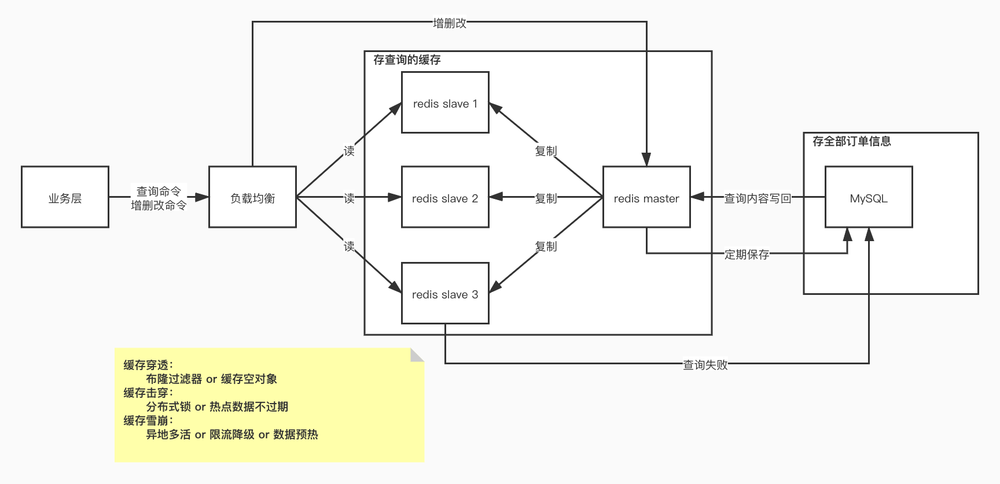
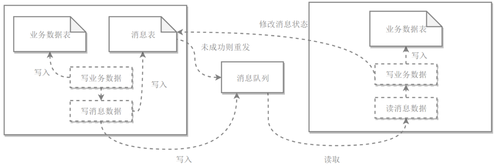

**【基础题】**

以下题目使用的数据表结构如下：

```sql
    CREATE TABLE `order_info` (
      `id` bigint(20) unsigned NOT NULL AUTO_INCREMENT,
      `order_id` varchar(32) NOT NULL COMMENT '订单号',
      `order_source` varchar(32) DEFAULT NULL COMMENT '订单来源',
      `user_id` varchar(32) DEFAULT NULL COMMENT '用户id',
      `order_status` varchar(32) DEFAULT NULL COMMENT '订单状态 0-已创建， 1-已提交，2-已支付，4-订单结束',
      `amount` decimal(10,4) DEFAULT NULL COMMENT '订单金额',
      `is_delete` tinyint(1) DEFAULT 0 COMMENT '是否删除，0-否，1-是',
      `create_by` varchar(32) DEFAULT NULL COMMENT '创建人',
      `update_by` varchar(32) DEFAULT NULL COMMENT '修改人',
      `create_time` timestamp(3) NOT NULL DEFAULT current_timestamp(3) COMMENT '创建时间',
      `update_time` timestamp(3) NOT NULL DEFAULT current_timestamp(3) ON UPDATE current_timestamp(3) COMMENT '更新时间',
      PRIMARY KEY (`id`),
      UNIQUE KEY `uk_order_id` (`order_id`)
    ) ENGINE=InnoDB AUTO_INCREMENT=19 DEFAULT CHARSET=utf8mb4
    
    CREATE TABLE `order_detail_info` (
      `id` bigint(20) unsigned NOT NULL AUTO_INCREMENT,
      `order_id` varchar(32) NOT NULL COMMENT '订单号',
      `item_id` varchar(32) DEFAULT NULL COMMENT '商品id',
      `item_amount` decimal(10,4) DEFAULT NULL COMMENT '商品金额',
      `create_by` varchar(32) DEFAULT NULL COMMENT '创建人',
      `update_by` varchar(32) DEFAULT NULL COMMENT '修改人',
      `create_time` timestamp(3) NOT NULL DEFAULT current_timestamp(3) COMMENT '创建时间',
      `update_time` timestamp(3) NOT NULL DEFAULT current_timestamp(3) ON UPDATE current_timestamp(3) COMMENT '更新时间',
      PRIMARY KEY (`id`),
      UNIQUE KEY `uk_order_id` (`order_id`)
    ) ENGINE=InnoDB AUTO_INCREMENT=19 DEFAULT CHARSET=utf8mb4
```

1. 用springboot + mybatis + mysql 实现一个订单restful服务，要求提供对订单的赠/删/查/改 restful api
   **目前实现：**
   使用restful 风格规范路由 ；增/删/改/查业务对应post/delete/put/get 方法；结果以 json 字符串返回。
   
2. 设计kafka topic：order_state_topic，基于kafka实现一个发布/订阅模型：当订单状态变化时，producer负责推送订单变化，consumer负责接收订单消息并打印，适当考虑并发能力、错误处理、消息幂等处理。
   **目前实现：**
   本地搭建 zookeeper server 和 Kafka server，当订单发生修改时，调用 kafkaTemplate 的send 方法，发送对应主题信息，OrderConsumerService 通过 @KafkaListener 订阅对应主题来接收信息，从而在控制台打印修改后的订单状态信息。应该是在两个不同的 module 中来分别创建生产者和消费者，目前只是在同一模块中简单的实现生产者和消费者的消息传递。

3. 基于redis对订单设计并实现一个缓存，要求查询尽量走缓存，更新时保证缓存和数据库的一致性，同时兼顾缓存的命中率和存储效率

**构架：**



**目前实现：**

在本地搭建 redis 集群，采用分片集群，一共六个 redis server，三个 master 三个 slave，将redis 数据库当作缓存，当根据id 查询订单时，如果 redis 中没有数据，则去mysql 中查询，并将查询结果加入 redis (可以设置一个失效时间)，如果redis中有对应数据，则直接去 redis 中查询。


**【进阶题】**

1. 假设用户下单成功的同时，系统需要进行减库存操作，库存系统和订单系统两个独立的系统，双方直接通过restful api进行交互，请实现一个业务下单接口：
  a) 保证下单成功减库存一定成功，否则下单不成功

  采用分布式事务，分布式事务一般有两种：

  - 两阶段提交
  - 本地消息表
    

  两阶段提交存在同步阻塞问题，所以一般采用**本地消息表**方法，通过消息队列实现异步。

  b) 保证高并发下不超卖

  **线程安全问题？给数据库加分布式锁？**

